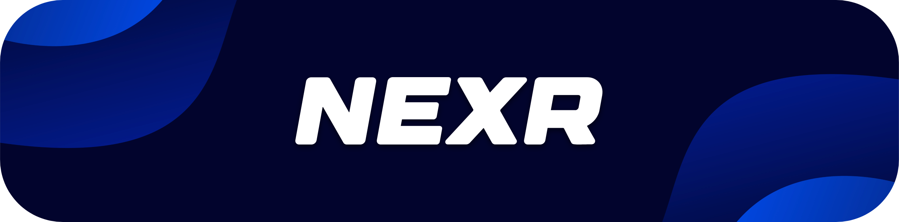

<!-- Banner -->

  

<h3 align="center">📚 Reading Imaginations...</h3>

---

## `👋` About Me
Hey! I’m **NexR** — a passionate **Discord Bot Developer** who loves creating interactive, feature-rich bots.  
I specialize in music, moderation, and AI-powered bots that make Discord servers more fun and functional.

- 💻 Mainly **JavaScript (Node.js)** & **Discord.js v14**
- 🛠 Experience with **MongoDB, Canvas, API integrations**
- ⚡ Always experimenting with new bot features

---

## `🛠` Tech Stack

  

---

## `🌐` Social Links

  
  
  
  
  
  

---

  

